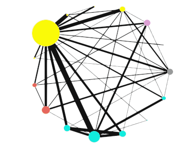

#  metavcov 

<!-- badges: start -->

<!-- badges: end -->

Collection of functions to compute covariances for different effect sizes, data visualization, and single and multiple imputations for missing data. Effect sizes include correlation (r), mean difference (MD), standardized mean difference (SMD), log odds ratio (logOR), log risk ratio (logRR), and risk difference (RD).

2017-03-29: release version 1.1

2021-08-21: release version 2.1

2022-10-07: update [vignettes](https://luminwin.github.io/metavcov/articles/intro.html)

2023-03-12: release version 2.1.4

<a href="https://luminwin.github.io/metavcov/articles/intro.html">
